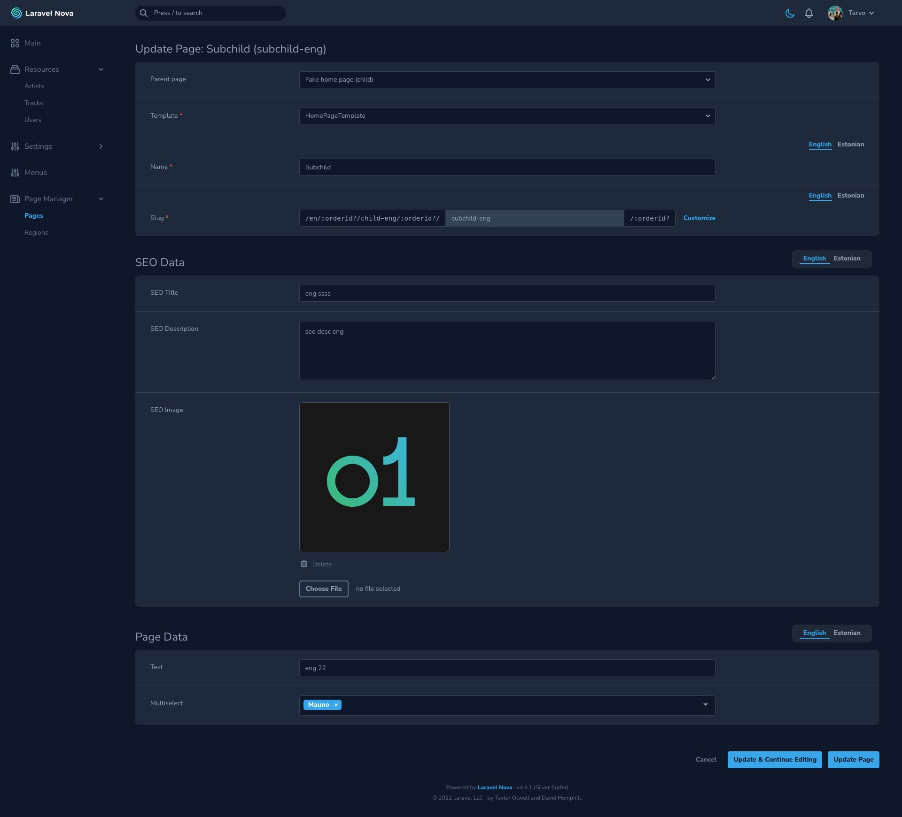

# Nova Page Manager

[](https://packagist.org/packages/outl1ne/nova-page-manager)
[](https://packagist.org/packages/outl1ne/nova-page-manager)

This [Laravel Nova](https://nova.laravel.com) package allows you to create and manage pages and regions for your frontend application.

## Requirements

```
- PHP >=8.0
- laravel/nova ^4.13
```

## Features

- Page and region management w/ custom fields
- Multiple locale support

## Screenshots



## Installation

Install the package in a Laravel Nova project via Composer and run migrations:

```bash
# Install package
composer require outl1ne/nova-page-manager

# Run automatically loaded migrations
php artisan migrate
```

Publish the `nova-page-manager` configuration file and edit it to your preference:

```bash
php artisan vendor:publish --provider="Outl1ne\PageManager\NPMServiceProvider" --tag="config"
```

Register the tool with Nova in the `tools()` method of the `NovaServiceProvider`:

```php
// in app/Providers/NovaServiceProvider.php

public function tools()
{
    return [
        // ...
        new \Outl1ne\PageManager\PageManager(),
    ];
}
```

## Usage

### Creating templates

Templates can be created using the following Artisan command:

```bash
php artisan npm:template {className}
```

This will ask you a few additional details and will create a base template in `App\Nova\Templates`.

The base template exposes a few overrideable functions:

```php
// Name displayed in CMS
public function name(Request $request)
{
    return parent::name($request);
}

// Fields displayed in CMS
public function fields(Request $request): array
{
    return [];
}

// Resolve data for serialization
public function resolve($page): array
{
    // Modify data as you please (ie turn ID-s into models)
    return $page->data;
}

// Page only
// Optional suffix to the route (ie {blogPostName})
public function pathSuffix() {
    return null;
}
```

### Registering templates

All your templates have to be registered in the `config/nova-page-manager.php` file.

```php
// in /config/nova-page-manager.php

// ...
'templates' => [
    'pages' => [
        'home-page' => [
            'class' => '\App\Nova\Templates\HomePageTemplate',
            'unique' => true, // Whether more than one page can be created with this template
        ],
    ],
    'regions' => [
        'header' => [
            'class' => '\App\Nova\Templates\HeaderRegionTemplate',
            'unique' => true,
        ],
    ],
],
// ...
```

### Defining locales

The locales are defined in the config file.

```php
// in /config/nova-page-manager.php

// ...
'locales' => [
  'en' => 'English',
  'et' => 'Estonian',
],

// OR

'locales' => function () {
  return Locale::all()->pluck('name', 'key');
},

// or if you wish to cache the configuration, pass a function name instead:

'locales' => NPMConfiguration::class . '::locales',
// ...
```

### Add links to front-end pages

To display a link to the actual page next to the slug, add or overwrite the closure in `config/nova-page-manager.php` for the key `base_url`.

```php
// in /config/nova-page-manager.php

'base_url' => 'https://webshop.com', // Will add slugs to the end to make the URLs

// OR

'base_url' => function ($page) {
  return env('FRONTEND_URL') . '/' . $page->path;
},
```

### Overwriting models and resources

You can overwrite the page/region models or resources, just set the new classes in the config file.

## Helper functions

Helper functions can be found in the `Outl1ne\PageManager\Helpers\NPMHelpers` class.

### NPMHelpers::getPagesStructure()

Calls `resolve()` on their template class and returns all pages as a tree where child pages are nested inside the `children` array key recursively.

### NPMHelpers::getPages()

Calls `resolve()` on their template class and returns all pages. Returns an array of arrays.

### NPMHelpers::getRegions()

Calls `resolve()` on their template class and returns all regions. Returns an array of arrays.

### NPMHelpers::getPageByTemplate($templateSlug)

Finds a single page by its template slug (from the config file), calls `resolve()` on its template class and returns it.

### NPMHelpers::getPagesByTemplate($templateSlug)

Same as `getPageByTemplate`, but returns an array of pages.

### NPMHelpers::formatPage($page)

Calls `resolve()` on the page's template class and returns the page as an array.

### NPMHelpers::formatRegion($region)

Calls `resolve()` on the region's template class and returns the region as an array.

## Localization

The translation file(s) can be published by using the following command:

```bash
php artisan vendor:publish --provider="Outl1ne\PageManager\ToolServiceProvider" --tag="translations"
```

You can add your translations to `resources/lang/vendor/nova-page-manager/` by creating a new translations file with the locale name (ie `et.json`) and copying the JSON from the existing `en.json`.

## Credits

- [Tarvo Reinpalu](https://github.com/Tarpsvo)
- [Kaspar Rosin](https://github.com/KasparRosin)

## License

Nova page manager is open-sourced software licensed under the [MIT license](LICENSE.md).
