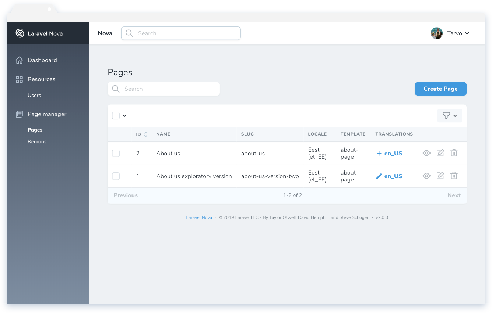
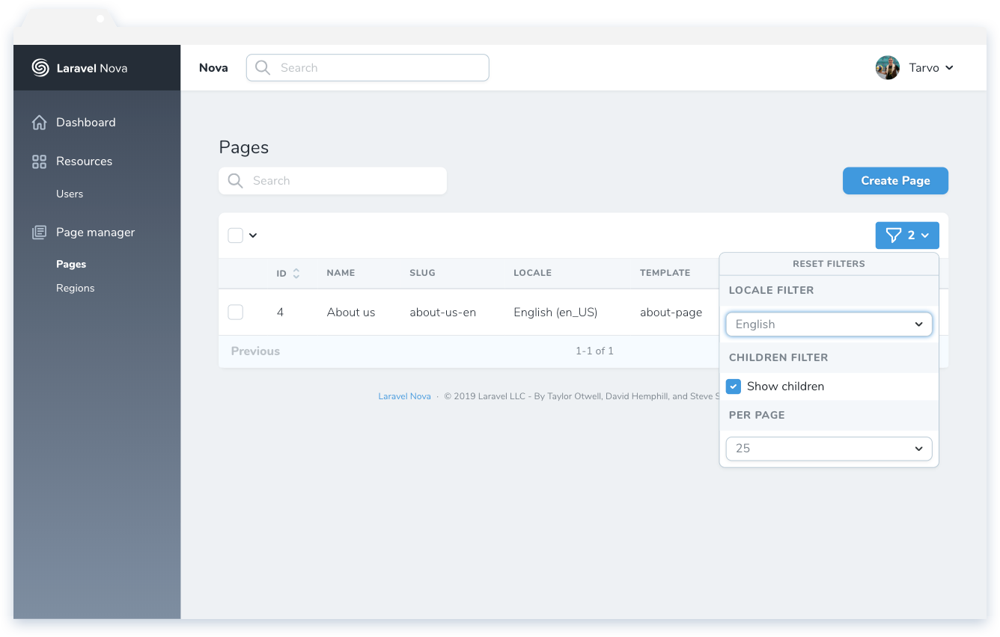
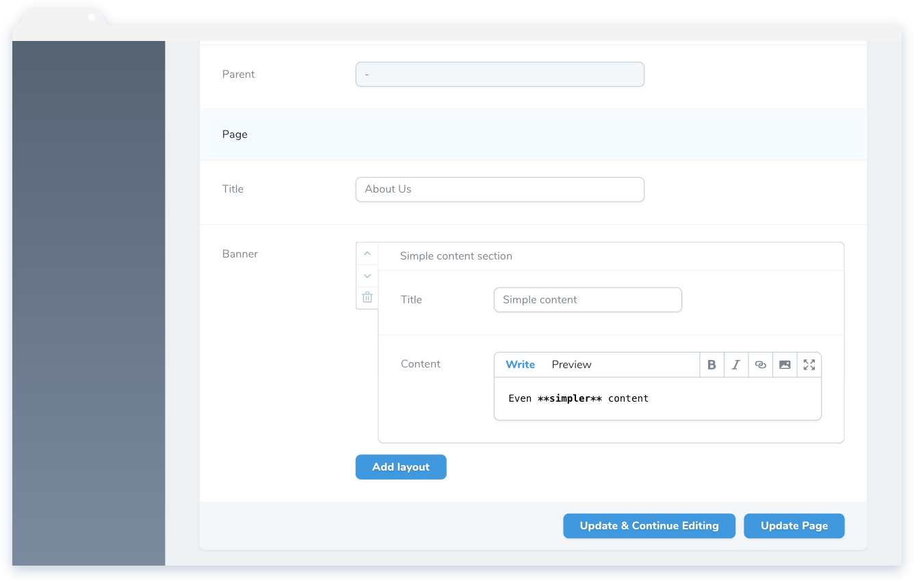

# Nova Page Manager

[](https://packagist.org/packages/optimistdigital/nova-page-manager)
[](https://packagist.org/packages/optimistdigital/nova-page-manager)

This [Laravel Nova](https://nova.laravel.com) package allows you to create and manage pages and regions. The package is geared towards headless CMS's.

## Requirements

- Laravel Nova <= 2.0.7 || >= 2.0.10

Laravel Nova 2.0.8 and 2.0.9 are breaking for Nova Page Manager.

## Features

- Pages and Regions management
- Programmatically created templates for Pages and Regions
- Multilanguage support
- Optional pages draft support

## Screenshots







## Installation

Install the package in a Laravel Nova project via Composer and run migrations:

```bash
# Install package
composer require optimistdigital/nova-page-manager

# Run automatically loaded migrations
php artisan migrate
```

Publish the `nova-page-manager` configuration file and edit it to your preference:

```bash
php artisan vendor:publish --provider="OptimistDigital\NovaPageManager\ToolServiceProvider" --tag="config"
```

Register the tool with Nova in the `tools()` method of the `NovaServiceProvider`:

```php
// in app/Providers/NovaServiceProvider.php

public function tools()
{
    return [
        // ...
        new \OptimistDigital\NovaPageManager\NovaPageManager
    ];
}
```

## Usage

### Creating templates

Templates can be created using the following Artisan command:

```bash
php artisan pagemanager:template {className}
```

This will ask you a few additional details and will create a base template in `App\Nova\Templates`.

The template base has a few properties:

```php
// Define whether the template is for a page or a region
// Applicable values: 'page', 'region'
public static $type = 'page';

// The unique name for the page, usually similar to a slug
public static $name = 'about-us';

// The package has built in SEO fields support
// This boolean decides whether or not to display them
public static $seo = false;

// If you want to have multiple views with different
// templates, you can set two templates to have the
// same 'view' string and use it instead for matching
public static $view = null;

// Return all fields here, just as you would inside a resource
public function fields(Request $request): array
{
  return [
      Text::make('Title', 'title')
  ];
}
```

### Registering templates

All your templates have to be registered in the `config/nova-page-manager.php` config file.

```php
// in /config/nova-page-manager.php

// ...
'templates' => [
  \App\Nova\Templates\HomePageTemplate::class,
],
// ...
```

### Defining locales

Locales can be defined similarly to how templates are registered. The config accepts a dictionary of locales.

```php
// in /config/nova-page-manager.php

// ...
'locales' => [
  'en' => 'English',
  'et' => 'Estonian',
],

// OR

'locales' => function () {
  return Locale::all()->pluck('name', 'key');
},

// if you wish to cache the configuration, pass a reference instead:

'locales' => NovaPageManagerConfiguration::class . '::locales',
// ...
```

### Enabling page draft feature

Draft feature allows you to create previews of pages before publishing them. By default this feature is not installed, but you can install [nova-drafts](https://github.com/optimistdigital/nova-drafts) with the following command.

```bash
composer require optimistdigital/nova-drafts
```

### Modify page path

To add a locale prefix to page paths or to modify page paths for any other reason on the `Page` model, supply a callback to `page_path` in the config.

```php
// in /config/nova-page-manager.php

// ...
'page_path' => function (Page $page) {
  return "{$page->locale}/{$page->path}";
},

// if you wish to cache the configuration, pass a reference instead:

'page_path' => NovaPageManagerConfiguration::class . '::pageUrl',
// ...
```

### Add links to front-end pages

To display a link to the actual page next to the slug, add or overwrite the closure in `config/nova-page-manager.php` for the key `page_url`.

```php
// in /config/nova-page-manager.php

// ...
'page_url' => function (Page $page) {
  return env('FRONTEND_URL') . $page->path;
},

// if you wish to cache the configuration, pass a reference instead:

'page_url' => NovaPageManagerConfiguration::class . '::pageUrl',
// ...
```

### Overwrite package resources

You can overwrite the package resources (Page & Region) by setting the config options in `nova-page-manager.php`.

Note: If you create your resources under `App\Nova` namespace, to avoid key duplication you must manually register all other resources in the `NovaServiceProvider`. See [registering resources](https://nova.laravel.com/docs/2.0/resources/#registering-resources) on Nova documentation.

## Modifying Field values

All fields have a registered macro `resolveResponseUsing(callable $resolveResponseCallback)` which allows you to modify the field's value before it is returned through the Page Manager's API (ie `nova_get_page()`).

The signature for the callback is: `function ($value, $templateModel) { ... }`.

For example:

```
Multiselect::make('Products')
  ->options(Product::all()->pluck('name', 'id'))
  ->resolveResponseUsing(function ($value, $templateModel) {
      return Product::findMany($value);
  }),
```

## Helper functions

### nova_get_pages_structure(\$previewToken)

The helper function `nova_get_pages_structure($previewToken)` returns the base pages structure (slugs, templates, child-parent relationships) that you can build your routes upon in the front-end. This does not return the pages' data. Preview token is optional and used only if draft feature is enabled. By default drafts will not be included in the structure.

Example response:

```json
[
  {
    "locales": ["en_US", "et_EE"],
    "id": {
      "en_US": 3,
      "et_EE": 4
    },
    "name": {
      "en_US": "Home",
      "et_EE": "Kodu"
    },
    "slug": {
      "en_US": "/",
      "et_EE": "/"
    },
    "template": "home-page",
    "children": [
      {
        "locales": ["en_US"],
        "id": {
          "en_US": 5
        },
        "name": {
          "en_US": "About"
        },
        "slug": {
          "en_US": "about"
        },
        "template": "home-page"
      }
    ]
  }
]
```

### nova_get_regions()

The helper function `nova_get_regions()` returns all the regions and their data.

Example response:

```json
[
  {
    "locales": ["en_US"],
    "id": {
      "en_US": 3
    },
    "name": {
      "en_US": "Main header"
    },
    "template": "main-header",
    "data": {
      "en_US": {
        "content": [
          {
            "layout": "horizontal-text-section",
            "attributes": {
              "text": "Lorem ipsum"
            }
          }
        ]
      }
    }
  }
]
```

### nova_get_page(\$pageId)

The helper function `nova_get_page($pageId)` finds and returns the page with the given ID.

Example response for querying page with ID `3` (`nova_get_page(3)`):

```json
{
  "locale": "en_US",
  "id": 3,
  "name": "Home",
  "slug": "/",
  "data": {
    "banner": [],
    "categories_grid": []
  },
  "template": "home-page"
}
```

### nova_get_page_by_slug($slug, $previewToken)

The helper function `nova_get_page_by_slug($slug, $previewToken)` finds and returns the page with the given slug. Preview token is optional and used to query draft pages when draft feature is enabled.

Example response for querying page with slug `/home` and preview token `L1SVNKDzBNVkBq8EQSna` (`nova_get_page("home", "L1SVNKDzBNVkBq8EQSna")`):

```json
{
  "locale": "en_US",
  "id": 3,
  "name": "Home",
  "slug": "/",
  "data": {
    "banner": [],
    "categories_grid": []
  },
  "template": "home-page",
  "preview_token": "L1SVNKDzBNVkBq8EQSna"
}
```

### nova_get_page_by_path($slug, $previewToken, \$locale)

The helper function `nova_get_page_by_path($slug, $previewToken, $locale)` finds and returns the page with the given path and all of it's parents. Preview token and locale are optional. Preview token is used to query draft pages when draft feature is enabled.

Example response for querying page with slug `/home/about` and preview token `L1SVNKDzBNVkBq8EQSna` (`nova_get_page("home/about", "L1SVNKDzBNVkBq8EQSna")`):

```json
{
  "locale": "en_US",
  "id": 2,
  "name": "about",
  "slug": "about",
  "parent": {
    "locale": "en_US",
    "id": 1,
    "name": "home",
    "slug": "home",
    "path": "/home",
    "parent_id": null,
    "data": {
      "banner": [],
      "categories_grid": []
    },
    "template": "home-page"
  },
  "parent_id": 1,
  "template": "about-page",
  "preview_token": "L1SVNKDzBNVkBq8EQSna",
  "path": "/home/about"
}
```

## Credits

- [Tarvo Reinpalu](https://github.com/Tarpsvo)

## License

Nova page manager is open-sourced software licensed under the [MIT license](LICENSE.md).
